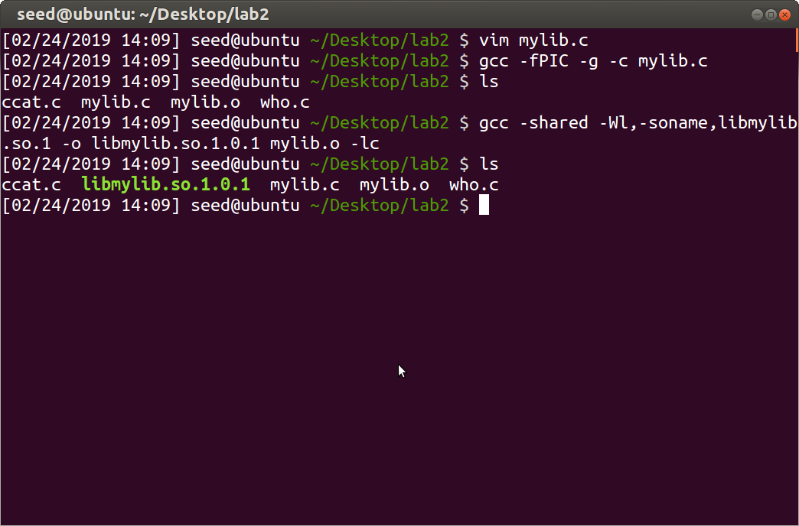
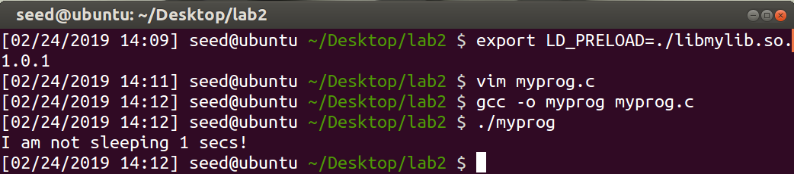

# Lab 2 Report

## Common Setuid Linux Programs

All three of the following programs have the `setuid` bit set.

* `/usr/bin/passwd`

  

* `/bin/su`

  

* `/usr/bin/sudo`

  

This means that if an ordinary user runs these programs, they will temporarily have elevated root
privileges while they run the program. This makes sense given that each of these programs require
higher permissions than many of their counterparts because they deal with user authentication and
related tasks.

So what happens if they are no longer `setuid` programs owned by the root user?

First, I copied each of the programs to a temporary directory owned by the `seed` user. This act
always unsets the `setuid` bit. Then, I attempted to run each of the three programs to observe their
behavior. I attempted to change the password for the `seed` user. The normal behavior of the `passwd(1)`
command is for a normal user to run the program (without `sudo`) and update their own password,
provided that they are able to successfully input their own password.

What happened when I ran the program without the `setuid` bit set is that it failed to set the `seed`
user's password. This is expected, because the password files are owned by root, so `passwd` must
somehow obtain root privileges. This is accomplished through the `setuid` bit, and the fact that
`passwd` is owned by root. Thus whenever a user runs the program, they are able to update the
system password files.


A similar failure occurred when I attempted to login to the `root` account from the `setuid`-less
`su` command. Since `su` did not have the `setuid` bit set, it was unable to obtain the elevated
privileges necessary to switch user accounts, even though the correct password was entered.


Similarly, when I attempted to change the ownership of a `root`-owned file with the `setuid`-less
`sudo` program, it failed for the same reason. However, note that this time it failed with a more
descriptive error message indicating that the `sudo` executable must have the `setuid` bit set *and*
be owned by `root`.

As an aside, I think it's interesting that the `sudo` program checks its own permissions and owner.


## Differences in Bash and Zsh

Here, I copied `/bin/bash` and `/bin/zsh` to `/tmp/` and ensured they were owned by `root` and had
the `setuid` bit set. Then after running each of the two shells, I executed the `whoami` command in
each shell.


When I ran `whoami` in the `zsh` shell session, it indicated that I was running the shell as the
`root` user. This is surprising, because I ran the `zsh` shell session *as the `seed` user*. So since
the `setuid` bit was set on the `zsh` executable, and the executable was owned by `root`, anyone
executing it will obtain `root` privileges for the duration of the shell session.

On the contrary, when I ran `whoami` in the `bash` shell session, it indicated that I was running the
shell as the `seed` user. This is also surprising given the results above with the `zsh` shell.

The difference is that Bash looks at the actual user id rather than the effective user id when checking
permissions. Each shell has the available permissions, being a `setuid` program owned by `root`, to
give the shell session access to the root user. However, Bash made a decision to use the actual user id
when setting the session user, so even though it is able to log in as the `root` user, it chooses
not to, likely as a security consideration.

## Setting the System `/bin/sh`

By default, Ubuntu systems symlink `/bin/sh` to `/bin/dash` (*not* `/bin/bash`!) in order to use `dash(1)`
as the default shell.


`dash(1)` is a much more limited shell that aims to be POSIX compliant while being as small as possible.
Thus, while it is the default shell used to execute scripts, we almost always add the shebang `#!/bin/bash`
to the top of shell scripts in order to execute them with a more powerful shell, `bash(1)`.

However, for the rest of the lab, I symlinked `/bin/sh` to `/bin/zsh`.


## Running Unintended Programs via the `PATH` Environment Variable

Then I wrote and compiled the following extremely complicated C program that runs the `ls` command using `system(3)`.

```c
int main()
{
    system("ls");
    return 0;
}
```

Note that the man page for `system(3)` contains the following paragraph on the dangers of `setuid`.


The reason this is a security vulnerability, is that `system(3)` uses `/bin/sh` to run the given command
in a new shell created with a copy of the current environment. Thus if you add a malicious program
to the beginning of your executable search `PATH`, you can run an arbitrary program with whatever
privileges the intended program was able to run with. This is because the search `PATH` is searched
from beginning to end for the desired program, and `/bin/sh` will run the first match found.

So if we inject our own version of `ls` at the beginning of our `PATH`, we can trick `/bin/sh` into
running our own program in place of the intended `/bin/ls`, *and do so with root privileges.*

To demonstrate this, I copied `/usr/bin/whoami` to my `lab2` directory and renamed it `ls`.


Then I compiled the above program, and changed the resultant executable to a `root`-owned `setuid`
program, and ran it before and after adding `~/Desktop/lab2` to my `PATH` environment variable.


Notice that not only was I able to convince `/bin/sh` to run my own malicious version of `ls`, I was
able to do so *with `root` privileges!* Thus the `system(3)` man page is correct, *do not use `system(3)`*
*from a `setuid` program!*

Now we symlinked `/bin/sh` to `/bin/zsh` above, but earlier we saw a difference in how `bash` treated
setuid programs opposed to `zsh`. So I symlinked `/bin/sh` to `bash` and to `dash` in order to compare
the results. What I saw was surprising.


All three of Zsh, Bash, and Dash ran the malicious imposter `ls` as root. From above, and from the
language in the lab assignment, I expected Bash to avoid doing so. However, this is not the behavior
I observed.

I think that the difference is that before, Bash itself was a `setuid` program running `whoami`. Here,
Bash is being ran *from a `setuid` program*, and is unable to perform the necessary introspection to
limit the user privileges.

## The Difference Between `system(3)` and `execve(2)`

So if using `system(3)` from a `setuid` program is off the table, what is the appropriate method for
running system commands? This portion of the lab examines one of the important differences between
`system(3)` and its related counterpart `execve(2)`.

I wrote and compiled the following program

```c
#include <string.h>
#include <stdio.h>
#include <stdlib.h>

int main( int argc, char** argv )
{
    char* v[3];
    if( argc < 2 )
    {
        printf( "Please enter a filename.\n" );
        return 1;
    }

    v[0] = "/bin/cat";
    v[1] = argv[1];
    printf( "filename: %s\n", argv[1] );
    v[2] = 0;

    // Set q = 0 or 1 for questions a and b rexpectively.
    int q = 0;

    if( q == 0 )
    {
        char* command = malloc( strlen(v[0]) + strlen(v[1]) + 2 );
        sprintf( command, "%s %s", v[0], v[1] );
        system( command );
    }
    else
    {
        execve( v[0], v, 0 );
    }

    return 0;
}
```

Notice that this is slightly different than the code listed in the lab assignment. I chose to print
the "filename" being passed through `argv[1]` to `/bin/cat`. This helped debug the program behavior
and enabled a deeper understanding of the `system(3)` behavior.

This program takes in a single commandline argument and passes that argument as a "filename" to `/bin/cat`.
So my goal was to trick `system(3)` into running arbitrary code with elevated root privileges. Recalling
from wherever I learned it, *Your shell* is responsible for parsing commandline arguments and passing those
to your program, including glob (`*`) expansion, special variable expansion (`~`), and normal variable
expansion (`$PATH`). One of the semantics of most shells, including those on Windows, is to treat arguments
surrounded with quotes *as a single argument* rather than splitting on spaces into multiple arguments.

This is why I added the extra `printf` in the program to display the argument, because it helped me
convince myself of exactly what is going on. Thus, I ran the program with the argument

```text
`/root/file && touch /root/test`
```

so that `system` would execute the entire command rather than splitting on spaces, or on logical
operators and execute only the first `/bin/cat` command as `root`. Other tricks using the special
Bash operators `|`, `>`, etc work identically.


The result is as expected; with the quotes, Bash parsed the entire command as the first commandline
argument, so that `system` executed the entire thing with elevated permissions. Without the quotes,
Bash parsed the command as multiple commandline arguments; first the command `./ccat /root/file`, performed
with elevated privileges, and second the command `touch /root/test` *without* elevated privileges.

This is a gaping security vulnerability, and one that can easily be fixed by replacing `system(3)` in
the `setuid` program with `execve(2)`. The difference between the two functions is that `system(3)`
runs an arbitrary shell command using `/bin/sh`, while `execve(2)` runs *a single executable program*
with an array of commandline arguments. Thus, it is not possible to trick `execve(2)` into executing
arbitrary shell commands as opposed to `system(3)`.


Here, using `execve`, the quoted commandline argument is treated as a single argument, rather than
being parsed by `/bin/sh` and then being ran.

## Overriding Runtim Dynamic Libraries With `LD_PRELOAD`

We can use the powerful `LD_PRELOAD` environment variable to force the runtime dynamic linker to use
our own custom (and possibly malicious) version of a dynamically linked library function in place of
the intended one. This variable is extremely useful in ordinary development practices, but is also
commonly leveraged in system exploitation.

Now, in the context of `setuid` programs, the runtime linker treats programs differently in some
conditions.

First, I created a dynamic library containing a function implementing the

```c
void sleep( int );
```

interface. Since the purpose of this lab is merely an educational proof of concept rather than an
actual attempt to perform anything malicious, I wrote the function

```c
#include <stdio.h>

void sleep( int s )
{
    printf( "I am not sleeping %d secs!\n", s );
}
```

and compiled it into a dynamic library with the commands

```shell
gcc -fPIC -g -c mylib.c
gcc -shared -Wl,-soname,libmylib.so.1 -o libmylib.so.1.0.1 mylib.o -lc
```



Then in order to test the library, I wrote the small program

```c
int main()
{
    sleep( 1 );
    return 0;
}
```

Then I set the `LD_PRELOAD` environment variable with the command

```shell
export LD_PRELOAD=./libmylib.so.1.0.1
```

and ran the program with different permissions and users to observe the results. If our `LD_PRELOAD`
injection was successful, the program will print `I am not sleeping 1 secs!` to the console and then
exit. If our injection failed, the program will link against the libc implementation of `void sleep( int )`,
which actually sleeps for the given number of seconds.

First, I ran the program with the usual permissions and user. This resulted in a successful `LD_PRELOAD` injection.



Then I made the `myprog` program a `setuid` program owned by root, and ran it as a normal user. This
did not result in the `LD_PRELOAD` injection working.


# TODO: I need to redo this. The environment variable does not seem to have been set when changing user accounts.

## Relinquishing Setuid Privileges and `open(2)`
