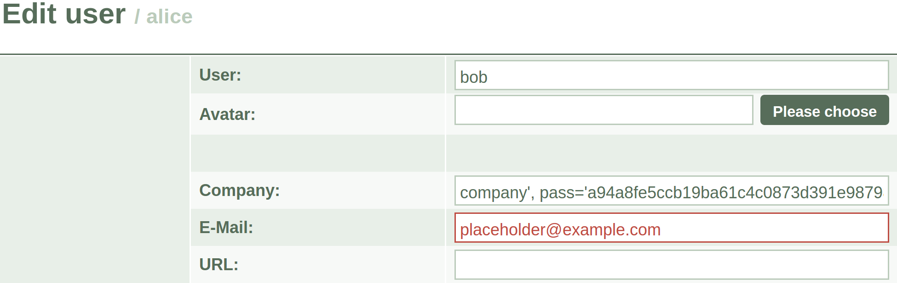
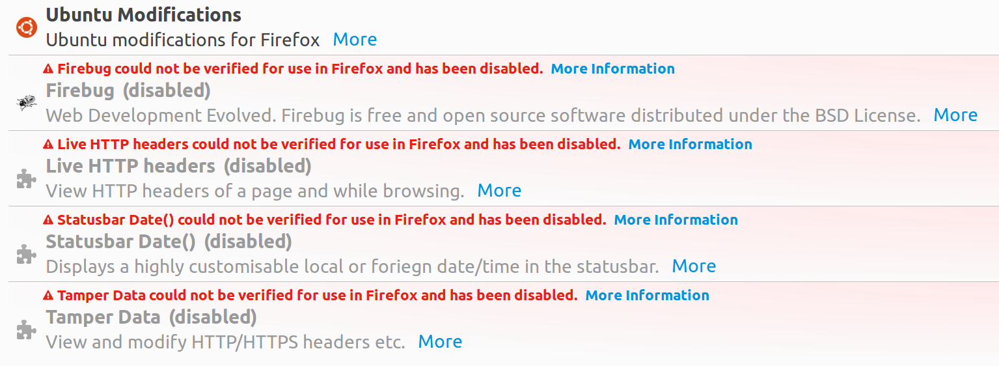
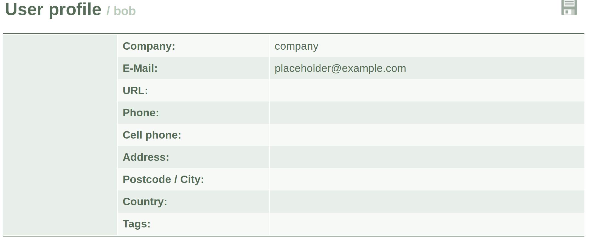

# Lab 3 Report

Austin Gill

## Lab Setup

The SEED VM image runs several Apache virtual hosts on startup. Then each virtual host is listed in
`/etc/hosts`

```text
127.0.0.1       www.OriginalPhpbb3.com
127.0.0.1       www.CSRFLabCollabtive.com
127.0.0.1       www.CSRFLabAttacker.com
127.0.0.1       www.SQLLabCollabtive.com
127.0.0.1       www.XSSLabCollabtive.com
127.0.0.1       www.SOPLab.com
127.0.0.1       www.SOPLabAttacker.com
127.0.0.1       www.SOPLabCollabtive.com
127.0.0.1       www.OriginalphpMyAdmin.com
```

as a fully-qualified domain name so that DNS resolution of [www.SQLLabCollabtive.com](www.SQLLabCollabtive.com)
will direct web traffic to the locally hosted web server.

Running `sudo service apache2 start` revealed that the web server was already running.
The usual setup for Apache is to run on startup, so I was not surprised.

I was able to view the locally hosted [www.SQLLabCollabtive.com](www.SQLLabCollabtive.com) website as expected.
However, running `nslookup` gave a non-local IP address.

```shell
seed@ubuntu ~ $ nslookup www.SQLLabCollabtive.com
Server:     192.168.80.2
Address:    192.168.80.2#53

Non-authoritative answer:
Name:    www.SQLLabCollabtive.com
Address: 103.224.182.243
```

This is unexpected, and doesn't agree with modifications I've made on my own system `/etc/hosts`. I expected `nslookup` to provide the local IP address of the VM.

However, accessing [www.SQLLabCollabtive.com](www.SQLLabCollabtive.com) from the host OS revealed that it is blocked by ITS, so I'm confident I was acting on the locally hosted site.

Further, both `ping` and `traceroute` behaved as expected, so I'm not sure why `nslookup` failed to resolve to `localhost`.

```shell
seed@ubuntu ~ $ ping www.SQLLabCollabtive.com
PING www.SQLLabCollabtive.com (127.0.0.1) 56(84) bytes of data.
64 bytes from localhost (127.0.0.1): icmp_req=1 ttl=64 time=0.033 ms
^C
--- www.SQLLabCollabtive.com ping statistics ---
1 packets transmitted, 1 received, 0% packet loss, time 0ms
rtt min/avg/max/mdev = 0.033/0.033/0.033/0.000 ms
seed@ubuntu ~ $ traceroute www.SQLLabCollabtive.com
traceroute to www.SQLLabCollabtive.com (127.0.0.1), 30 hops max, 60 byte packets
 1  localhost (127.0.0.1)  0.027 ms  0.007 ms  0.005 ms
```

I also modified the PHP code of the site to echo data to a temporary log file.
This objectively verified that I was acting on a locally hosted site.

I turned off the magic quotes countermeasure by editing `/etc/php5/apache2/php.ini` and changing

```ini
; Magic quotes are a preprocessing feature of PHP where PHP will attempt to
; escape any character sequences in GET, POST, COOKIE and ENV data which might
; otherwise corrupt data being placed in resources such as databases before
; making that data available to you. Because of character encoding issues and
; non-standard SQL implementations across many databases, it's not currently
; possible for this feature to be 100% accurate. PHP's default behavior is to
; enable the feature. We strongly recommend you use the escaping mechanisms
; designed specifically for the database your using instead of relying on this
; feature. Also note, this feature has been deprecated as of PHP 5.3.0 and is
; scheduled for removal in PHP 6.
; Default Value: On
; Development Value: Off
; Production Value: Off
; http://php.net/magic-quotes-gpc
magic_quotes_gpc = On
```

to

```ini
; -snip-
magic_quotes_gpc = Off
```

I also modified `/var/www/SQL/Collabtive/include/class.user.php` from

```php
function login($user, $pass)
{
    //modified for SQL Lab
    //$user = mysql_real_escape_string($user);
    //$pass = mysql_real_escape_string($pass);
    $pass = sha1($pass);

    $sel1 = mysql_query("SELECT ID,name,locale,lastlogin,gender FROM user WHERE (name = '$user' OR email = '$user') AND pass = '$pass'");
    // ...
}
```

to

```php
function login($user, $pass)
{
    //modified for SQL Lab
    //$user = mysql_real_escape_string($user);
    //$pass = mysql_real_escape_string($pass);
    $pass = sha1($pass);

    $logfile = "/tmp/lab3log.txt";
    $fd = fopen($logfile, 'a') or die("Can't open logfile");
    fwrite($fd, "user: $user\n");
    fclose($fd);

    $sel1 = mysql_query("SELECT ID,name,locale,lastlogin,gender FROM user WHERE (name = '$user' OR email = '$user') AND pass = '$pass'");
    // ...
}
```

Then the information from the log file can be viewed as it is updated by running the command `tail -f /tmp/lab3log.txt` in the terminal.
This did not yield any useful information other than making me more comfortable with PHP (I've never used PHP before).

## Login Page SQL Injection

As hinted by

```php
//modified for SQL Lab
//$user = mysql_real_escape_string($user);
//$pass = mysql_real_escape_string($pass);
$pass = sha1($pass);
```

there is a SQL injection vulnerability in the login page.
It is a quite trivial matter to gain access to any account, if the username is known.

Even though (for the purposes of this lab) the admin username and password were known, I attempted to log into the admin account first without the password.
I did this because `admin` is a very common username to try to login to, and I happened to know that the `admin` user would have access to a list of every other user on the system.

After it was known there was an `alice` user, my first attempt at a SQL injection was to try inputting the string

```text
alice' OR true)#
```

in the username field, and leaving the password blank.

However, this logged me into the `admin` account. This was quite unexpected, but makes sense in hindsight.

The effective query this injection resulted in was

```sql
SELECT ID,name,locale,lastlogin,gender FROM user WHERE (name = 'alice' OR true);
```

or rather,

```sql
SELECT ID,name,locale,lastlogin,gender FROM user WHERE true;
```

Thus I gained access to the very first user in the database, which happened to be the `admin` user.

Fixing the injection string to be simply `alice')#` resulted in a successful login of the `alice` user.
From there, I had access to anything `alice` had access to, including her "Edit Profile" page.

As discussed by the lab writeup, it is not possible to chain together multiple SQL statements in the same database connection in PHP.
This renders it impossible to modify the database when only a `SELECT` query is performed.
Thus it is not possible to modify the database from the login page.

## Edit Page SQL Injection

Viewing the "Edit Profile" page's PHP source revealed that the "Company" field had an intended injection vulnerability.

```php
function edit(/* -snip- */)
{
    $name = mysql_real_escape_string($name);
    $realname = mysql_real_escape_string($realname);
    // modified for SQL Lab
    //$company = mysql_real_escape_string($company);
    $email = mysql_real_escape_string($email);

    // -snip-
}
```

Then I looked at the `UPDATE` query that was being performed.

```sql
UPDATE user SET name='$name', email='$email', tel1='$tel1', tel2='$tel2', company='$company', zip='$zip', gender='$gender',url='$url', adress='$address1', adress2='$address2', state='$state', country='$country', tags='$tags', locale='$locale',rate='$rate' WHERE ID = $id";
```

I wanted to change `bob`'s password from the `alice` user's "Edit Profile" page, so this query led me to believe I needed a way to find out `bob`'s user `ID`.
This had me stumped for quite some time, but I decided to try using

```sql
UPDATE user SET name='$name', ..., company='$company', pass='...' WHERE name='bob';
```

even though `name` is not the unique primary key.
The downside of this is that I would be updating the password of every user with the name `bob`, but I would also not need a way to find `bob`'s `ID`.
I know it is possible to find the `ID`.
I would just need to find an area on the page where information from the database is displayed in response to a query.
It might also be possible to set `alice`'s `name` value to be the result of a query containing `bob`'s `ID`, because the `name` is displayed on the "Edit Profile" page.

However, I made the decision that setting every "bob" to have the same password would be acceptable and moved on.

So I proceded with the strategy of using `WHERE name='bob'` in the query, but noticed something interesting.
I am unfamiliar with SQL - this is my first time using it in any meaningful capacity, so I was unsure of the implications of running the `UPDATE` below.

```sql
UPDATE user SET name='alice' WHERE name='bob';
```

So I decided to edit `alice`'s name field to contain `bob` while performing the SQL injection.
It turns out this was a good idea - even if by accident.

From looking at the PHP code, I noticed that the database stores the SHA1 hash of the passwords, so I needed to compute the hash of my intended replacement password before I could perform the query.

This is simple to do from the terminal.

```shell
seed@ubuntu ~ $ echo -n "test" | sha1sum
a94a8fe5ccb19ba61c4c0873d391e987982fbbd3  -
```

Note the use of the `-n` flag on the `echo` command. This prevents `echo` from appending a trailing newline to the end of the provided string.
The first time I computed the hash, it did not agree with what an online hash generator gave me, so I looked at the `echo` manpage and realized that I had hashed `"test\n"`, which could be tricky to enter into the password field.

Now, having enough information to complete the injection attack, I assembled the string

```text
company', pass='a94a8fe5ccb19ba61c4c0873d391e987982fbbd3' WHERE name='bob'#
```

and pasted that into the "Company" field of the form.



The email field is required via JavaScript, which performs RegEx validation.
This could be avoided by using the "Tamper Data" extension, but the "Tamper Data" extension no longer works on the version of Firefox installed.



This could be because I ran `sudo apt-get update && sudo apt-get upgrade` as one of the first steps of setting up the VM image because it's 7 years out of date, and there were several out-of-date or missing packages that I desired to make the VM terminal more usable.

In either case, it was possible to perform the injection without the extension, and logging into the `bob` user with the replacement password "test" worked successfully.




Note that `bob`'s profile page now contains the dummy company and email we provided.

# TODO:
## The Magic Quotes Countermeasure

# TODO:
## The String Escaping Countermeasure

# TODO:
## The Query Preparation Countermeasure
